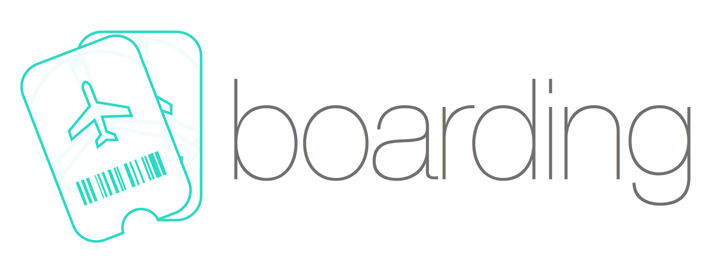
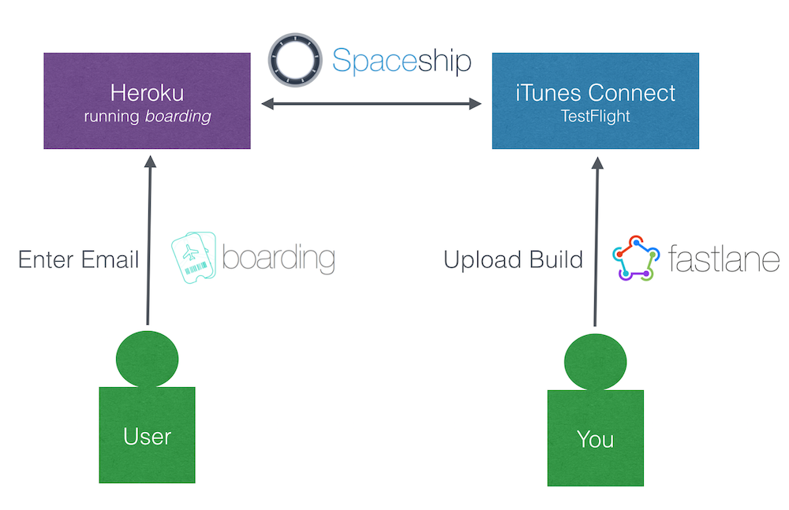
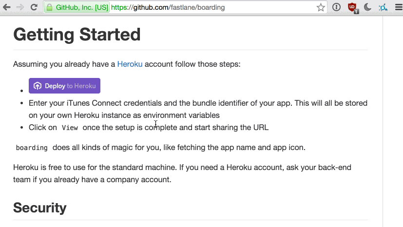

<h3 align="center">
  <a href="https://github.com/KrauseFx/fastlane">
    
     
    fastlane
  </a>
</h3>

  <a href="https://github.com/KrauseFx/deliver">deliver</a> &bull;
  <a href="https://github.com/KrauseFx/snapshot">snapshot</a> &bull;
  <a href="https://github.com/KrauseFx/frameit">frameit</a> &bull;
  <a href="https://github.com/KrauseFx/PEM">PEM</a> &bull;
  <a href="https://github.com/KrauseFx/sigh">sigh</a> &bull;
  <a href="https://github.com/KrauseFx/produce">produce</a> &bull;
  <a href="https://github.com/KrauseFx/cert">cert</a> &bull;
  <a href="https://github.com/KrauseFx/codes">codes</a> &bull;
  <a href="https://github.com/fastlane/spaceship">spaceship</a> &bull;
  <a href="https://github.com/fastlane/pilot">pilot</a> &bull;
  <b>boarding</b>

-------

  

-------

Get in contact with the developer on Twitter: [@KrauseFx](https://twitter.com/KrauseFx/)

-------

    <a href="#whats-boarding">Why?</a> &bull;
    <a href="#getting-started">Getting Started</a> &bull;
    <a href="#how-does-this-work">Technical Details</a> &bull;
    <a href="#customize">Customize</a> &bull;
    <a href="#update-to-a-new-version">Update</a>

-------

<h5 align="center"><code>boarding</code> is part of <a href="https://fastlane.tools">fastlane</a>: connect all deployment tools into one streamlined workflow.</h5>

# What's boarding?

Instantly create a simple signup page for TestFlight beta testers.

> Have you ever been to an airport, where you had to ask the manager of the airport if you can board now? Once the manager agrees, you'll be carried from your check-in to your gate into your plane.

Because that's what you do right now as an app developer when you want to add a new tester to your TestFlight app: [Open Screenshots](https://raw.githubusercontent.com/fastlane/boarding/master/assets/OldWay.jpg)

Why don't you have a simple web site you can share with potential testers (e.g. email newsletter, Facebook, Twitter) on which people interested in trying out your new app can just `board` on their own?

Thanks to [spaceship.airforce](https://spaceship.airforce) (oh well, I really talk a lot about flying :rocket:) it is now possible to automate the boarding process for your TestFlight beta testers.

### Example

#####Take a look at this live example page: [boarding.herokuapp.com](https://boarding.herokuapp.com)

[Like this tool? Be the first to know about updates and new fastlane tools](https://tinyletter.com/krausefx)

# Getting Started

Assuming you already have a [Heroku](https://heroku.com) account follow those steps:

- 
- Enter your iTunes Connect credentials and the bundle identifier of your app. This will all be stored on your own Heroku instance as environment variables
- Click on `View` once the setup is complete and start sharing the URL

`boarding` does all kinds of magic for you, like fetching the app name and app icon.

Heroku is free to use for the standard machine. If you need a Heroku account, ask your back-end team if you already have a company account. 

---

---

## Security

To secure your webpage, you only have to set the `ITC_TOKEN` environment variable to any password. 

- You can send your users the link and tell them the password
- You can send them the direct link including the token like this: https://url.com/?token=[password]

## Available environment variables

**Required:**

- `ITC_USER` iTunes Connect username
- `ITC_PASSWORD` iTunes Connect password
- `ITC_APP_ID` The Apple ID or Bundle Identifier of your app

**Optional:**
- `ITC_TOKEN` Set a password to protect your website from random people signing up
- `ITC_CLOSED_TEXT` Set this text to temporary disable enrollment of new beta testers

## Custom Domain

With Heroku you can easily use your own domain, follow [this guide](https://devcenter.heroku.com/articles/custom-domains).

# How does this work?

`boarding` is part of [fastlane](https://fastlane.tools), which helps you automate everything you usually do manually as an iOS developer. 

Using [spaceship.airforce](https://spacehip.airforce) it is possible to manage testers, builds, metadata, certificates and so much more.

This repository is a simple Rails application with most code in these files:

- [invite_controller.rb](https://github.com/fastlane/boarding/blob/master/app/controllers/invite_controller.rb)
- [invite/index.html.erb](https://github.com/fastlane/boarding/blob/master/app/views/invite/index.html.erb)

# Customize

If you want to change the design, layout or even add new features:

- Install the [Heroku toolbelt](https://toolbelt.heroku.com/) and `heroku login`
- Clone your application using `heroku clone --app [heroku_app_name]`
- `cd [heroku_app_name]`
- Modify the content, in particular the files that are described above.
- Test it locally by running `ITC_USER="email" ITC_... rails s` and opening [http://127.0.0.1:3000](http://127.0.0.1:3000)
- Commit the changes
- `git push`

It is recommended to also store your version in your git repo additionally to Heroku.

# Update to a new version

From time to time there will be updates to `boarding`. There are 2 ways to update your Heroku application:

### Recommended: Using the terminal

- Install the [Heroku toolbelt](https://toolbelt.heroku.com/) and `heroku login`
- Clone your application using `heroku clone --app [heroku_app_name]`
- `cd [heroku_app_name]`
- `git pull https://github.com/fastlane/boarding`
- `git push`

### Using Heroku website

- Delete your application on [heroku.com](https://heroku.com)
- [Create a new boarding application](https://heroku.com/deploy?template=https://github.com/fastlane/boarding)
- Enter your user credentials again

##### [Like this tool? Be the first to know about updates and new fastlane tools](https://tinyletter.com/krausefx)

# License
This project is licensed under the terms of the MIT license. See the LICENSE file.

> This project and all fastlane tools are in no way affiliated with Apple Inc. This project is open source under the MIT license, which means you have full access to the source code and can modify it to fit your own needs. All fastlane tools run on your own computer or server, so your credentials or other sensitive information will never leave your own computer. You are responsible for how you use fastlane tools.

# Contributing

1. Create an issue to start a discussion about your idea
2. Fork it (https://github.com/fastlane/boarding/fork)
3. Create your feature branch (`git checkout -b my-new-feature`)
4. Commit your changes (`git commit -am 'Add some feature'`)
5. Push to the branch (`git push origin my-new-feature`)
6. Create a new Pull Request
